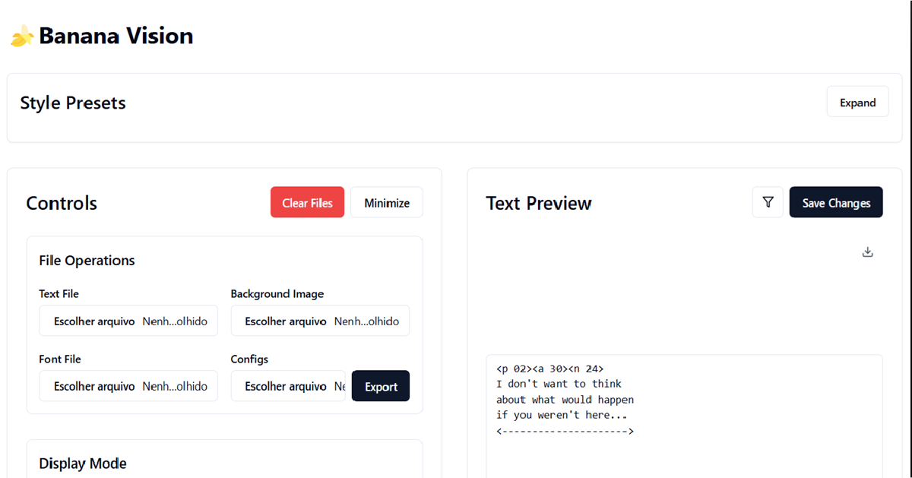

# 🍌 Banana Vision

Banana Vision is a powerful and flexible text preview tool designed for game developers and content creators. It allows you to visualize and style text blocks with various effects, supporting both system fonts and bitmap fonts.



## Features

### Text Styling
- Font size, line height, and letter spacing customization
- Text alignment (horizontal and vertical)
- Text wrapping with adjustable width
- Bold text option
- Custom font support (TTF/OTF)

### Effects
- Text shadow with customizable offset, blur, and color
- Text stroke with adjustable width and color
- Color tags for dynamic text coloring
- Tag replacement system

### Bitmap Font Support
- Import bitmap font images
- Customizable character mapping
- Adjustable tile dimensions and spacing
- Color customization and zoom control

### Additional Features
- Single block or all blocks display modes
- Background image support
- Export settings as JSON
- Gallery of preset configurations
- Overflow detection
- PNG export capability

## Installation

1. Clone the repository:
```bash
git clone https://github.com/Dyeus-Phater/Banana-Vision.git
```

2. Install dependencies:
```bash
npm install
```

3. Start the development server:
```bash
npm run dev
```

## Usage

### Basic Text Preview
1. Upload a text file or use the default script
2. Adjust text styling options in the Controls panel
3. Preview changes in real-time
4. Export the result as PNG when satisfied

### Using Bitmap Fonts
1. Enable Bitmap Font in the Controls panel
2. Upload your bitmap font image (PNG)
3. Configure the character sequence and tile dimensions
4. Adjust spacing and baseline settings as needed

### Saving and Loading Configurations
- Export your current settings using the Export button
- Import previously saved settings using the Config upload
- Use the Gallery to quickly apply preset styles

## Contributing

Contributions are welcome! Please feel free to submit a Pull Request.

## Support

If you find this tool useful, consider supporting the development via Lightning Network:

```
lnurl1dp68gurn8ghj7ampd3kx2ar0veekzar0wd5xjtnrdakj7tnhv4kxctttdehhwm30d3h82unvwqhhgctdv4exjcmgv9exgdek8pvr5f
```

## License

This project is licensed under the MIT License - see the [LICENSE](LICENSE) file for details.